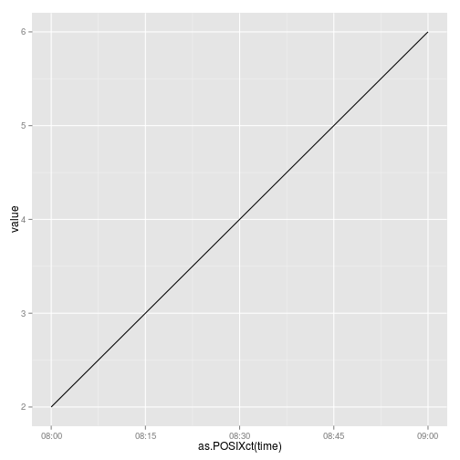

# Plot a day time series without associated dates


The Coursera course "reproducible research" involved a problem where data 
was in the following form:

```r
time_data <- data.frame( time = c(800,815,830,845,900) , value = 2:6)
time_data
```

```
##   time value
## 1  800     2
## 2  815     3
## 3  830     4
## 4  845     5
## 5  900     6
```


The task is to plot value vs time. The date is irrelevant for this data set.
A time format that only stores the time since the start of the day would 
be suitable. ITime from data.table provides such a format.  
Convert the time data to ITime:

```r
library(data.table)
to_ITime <- function(x){
    x <- as.character(x)
    n <- nchar(x)
    as.ITime(paste0(substr(x,1,n-2),":",substr(x,n-1,n)))
}
time_data[,"time"] <- as.data.frame(to_ITime(time_data[,"time"]))
class(time_data[,"time"])
```

```
## [1] "ITime"
```


Creating the plot:

```r
library(ggplot2)
ggplot(time_data,aes(as.POSIXct(time),value))+geom_line()
```

 

